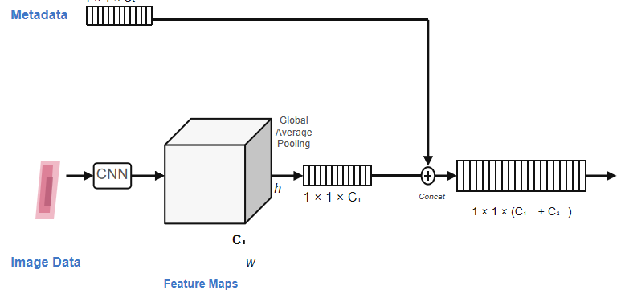
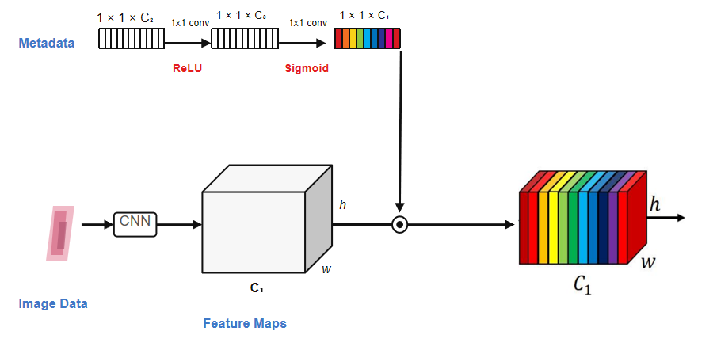
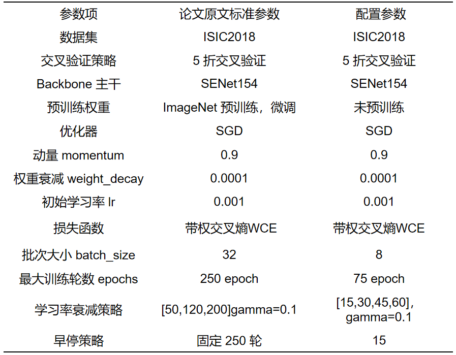
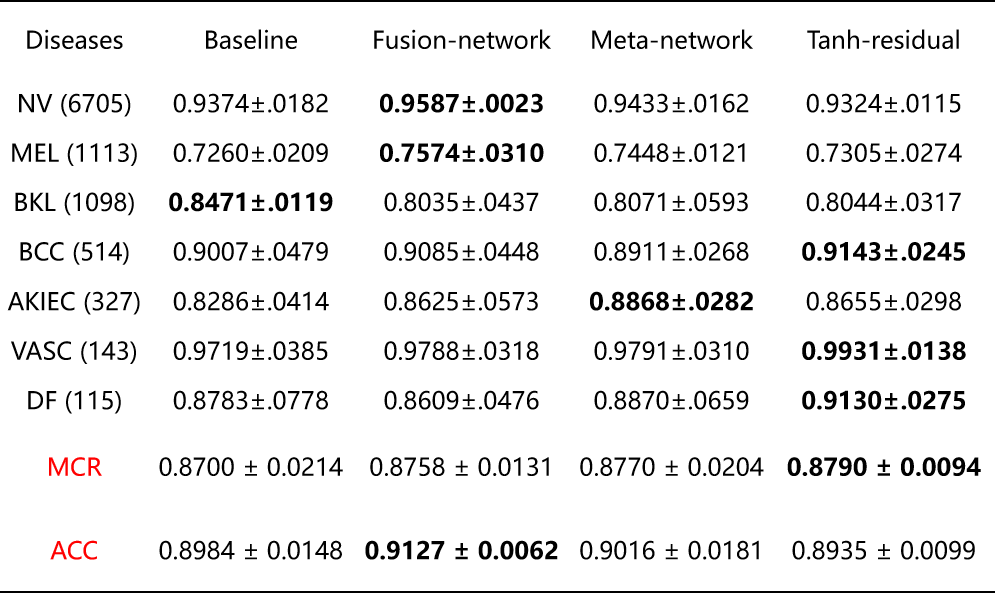

> 本文记录了我复刻论文 **"Fusing Metadata and Dermoscopy Images for Skin Disease Diagnosis"** 的完整过程，以及在原方法基础上所做的多项改进实验与结果分析。虽然最后的结果与期待的有所差异，提升不大，但这个过程的确发现了许多问题，也算'辗转反侧'解决了。

---

## 一、故事背景

### 1.1 原论文简介

该论文针对**皮肤镜图像诊断中如何有效利用临床元数据（年龄、性别、病变部位）** 这一问题，提出了一个元数据门控机制（MetaNet）。

在皮肤科临床实践中，医生诊断时不仅看皮肤镜图像，还会结合患者的年龄、性别、病史等信息。然而，标准的 CNN 分类模型只能处理图像输入，无法利用这些临床元数据。简单地在分类器前将元数据特征与图像特征拼接（concat）存在两个问题：



1. **融合位置太晚** — 拼接发生在池化之后，元数据无法影响特征提取过程
2. **缺乏通道选择性** — 拼接对所有通道一视同仁，无法体现"不同通道对不同元数据的敏感度不同"

MetaNet 的核心思路是：**让临床元数据生成图像特征通道的门控权重，在特征图层面调制图像特征，使元数据能够影响"模型看哪里"和"怎么看"**。

**核心思想**：让临床元数据生成图像特征通道的门控权重，在特征图层面调制图像特征，而不是简单地在分类器前拼接。



**三种基础方法**：

| 方法 | 描述 |
|------|------|
| **Image-only (Baseline)** | 仅使用皮肤镜图像，不使用元数据 |
| **Fusion-network (Concat)** | 图像特征与元数据特征在池化后拼接 |
| **Meta-network (MetaNet)** | 元数据生成通道门控，调制图像特征图 |

### 1.2 数据集

| 项目 | 内容 |
|------|------|
| 数据集 | ISIC 2018 Task 3 / HAM10000 |
| 类别 | 7 类皮肤病变（MEL, NV, BCC, AKIEC, BKL, DF, VASC） |
| 样本数 | ~10,015 张皮肤镜图像 |
| 元数据 | 17 维（年龄×1 + 性别×2 + 解剖部位×14） |
| 评估指标 | **MCR（Mean Class Recall）**— 七类召回率的均值 |
| 验证方式 | Stratified 5-Fold Cross Validation |

### 1.3 类别不平衡问题

ISIC 2018 存在严重的类别不平衡：

| 类别 | 含义 | 样本占比 |
|------|------|---------|
| NV | 黑素细胞痣 | ~67% |
| MEL | 黑色素瘤 | ~11% |
| BCC | 基底细胞癌 | ~5% |
| BKL | 良性角化病 | ~11% |
| AKIEC | 光化性角化病 | ~3% |
| DF | 皮肤纤维瘤 | ~1% |
| VASC | 血管病变 | ~1% |

所以这里采用 MCR 作为评估指标，以更公平地反映模型能力。

---

## 二、复刻流程

### 2.1 整体架构

整个项目的完整数据流如下：

```
原始数据 (data/isic2018/raw/)
 ├─ ISIC_*.jpg (10015张皮肤镜图像)
 ├─ GroundTruth.csv (7类one-hot标签)
 └─ HAM10000_metadata.csv (age/sex/location)
         │
         ▼
数据预处理 (scripts/prepare_isic2018.py)
 ① 搜索标签CSV → 识别标签格式
 ② 索引全部图像 → 映射路径
 ③ 标准化元数据: age归一化, sex/location one-hot
 ④ 合并标签 + 元数据 + 图像路径
 ⑤ StratifiedKFold 五折划分
 ⑥ 输出 dataset.csv + 5折train/val CSV
         │
         ▼
数据加载 (dataset/isic_dataset.py)
 ISICDataset 每次返回:
 ├─ image:    Tensor[3, 224, 224] (增强后)
 ├─ metadata: Tensor[17] (年龄+性别+部位)
 └─ label:    int (0-6 七分类)
         │
    ┌────┴────┐
    ▼         ▼
Train Loader  Val Loader
    │         │
    └────┬────┘
         ▼
模型 (models/isic_metanet.py)
 ISICMetaNetModel
 image → Backbone → fmap [B, C, H, W]
 metadata → MLP → gate [0,1] 或 [-1,1]

 6种融合策略可选:
 ├─ image_only:      池化→分类器
 ├─ concat:          拼接图像+元数据特征
 ├─ full:            fmap × gate (原论文)
 ├─ full_residual:   fmap × (1 + α·gate)
 ├─ tanh_residual:   fmap × (1 + α·gate) (前sigmoid改为tanh)
 └─ residual_calibration:
      concat(GAP(img), GAP(α·gate·img)) + 双重损失
         │
         ▼
训练 (training/isic_trainer.py)
 train_fold(fold) 或 train_all_folds()
 每epoch → train → val → MCR提升时保存最佳
 MCR连续patience轮不升 → 提前停止
         │
    ┌────┴────┐
    ▼         ▼
五折汇总    可解释性导出
 fold_0~4    export metadata activations
 mean±std    gate_sigmoid / alpha / g_tanh
    │
    ▼
结果汇总 (final_analysis/)
 ├─ quick_summary.csv (全部实验MCR/Acc对比)
 ├─ tables/ (每类召回率表格)
 ├─ experiments/ (每个实验结果副本)
 └─ metadata_activations/ (门控权重导出)
```

### 2.2 数据预处理

**元数据编码方案**：

```
原始字段 → 编码方式 → 输出维度
─────────────────────────────────
age      → min-max 归一化          →  1 维
sex      → one-hot (female/male)   →  2 维
location → one-hot (14 个部位)      → 14 维
─────────────────────────────────
合计                              → 17 维
```
> 数值字段进行归一化处理，范围 [0, 1]
> 类别字段进行 one-hot 编码，每个类别对应一个二进制特征

**数据预处理详细流程**：

---

**① 搜索标签 CSV → 识别标签格式**

```
遍历 raw_dir 下所有 CSV 文件
  │
  ├─ 若包含 image + MEL/NV/BCC/AKIEC/BKL/DF/VASC 七列 one-hot
  │    → 识别为 ISIC 官方格式，直接取 argmax 得到标签
  │
  ├─ 若包含 image_id + dx (diagnosis) 列
  │    → 识别为 HAM10000/Kaggle 格式
  │    → 通过 DX_TO_LABEL 映射表转换为七分类标签
  │
  └─ 若只找到 LesionGroupings 等无关文件
       → 抛出明确错误，提示缺少训练标签
```

---

**② 索引全部图像 → 映射路径**

```python
IMAGE_EXTS = {".jpg", ".jpeg", ".png"}
images[path.stem] = path.resolve()  # 
```

- 遍历 raw 目录递归搜索所有图像文件
- 以文件名（去掉后缀）作为 key 建立索引
- 后续 CSV 中的 image_id 去掉 `.jpg` 后匹配

---

**③ 标准化元数据**

这一步将原始的 age/sex/anatom_site_general 转换为 17 维数值向量：

**age 处理**：
```
原始 age → 数值化 → 缺失值用均值填补 → min-max 归一化到 [0,1]
```
$$
\text{metadata\_age} = \frac{\text{age} - \text{age\_min}}{\text{age\_max} - \text{age\_min}}
$$

**sex 处理**：
```
原始 sex → 小写化 → unknown/nan 视为缺失 → 缺失用众数填补
         → one-hot: [metadata_gender_female, metadata_gender_male]
```

**location 处理**：
```
原始 anatom_site_general → 小写化 → alias 标准化（如 scalp→head/neck）
                         → 缺失用众数填补 → 14 维 one-hot 编码
```

**location alias 映射**（不同数据集对同一部位的命名差异）：

| 原始值 | 归一化结果 |
|--------|-----------|
| scalp, neck, ear | head/neck |
| trunk | anterior torso |
| genital | oral/genital |
| acral | palms/soles |

---

**④ 合并标签 + 元数据 + 图像路径**

```
gt_df (标签) ──┐
               ├── merge on "image" ──→ 完整 DataFrame
meta_df (元数据) ─┘
                    │
                    ├── 检查合并后是否有缺失行
                    ├── 检查每张图像是否实际存在于文件系统
                    ├── 建立 sample_id（唯一标识）
                    └── 构建 one-hot 标签列 + label_name
```

合并后的 dataset.csv 包含：

| 字段类别 | 字段 | 说明 |
|---------|------|------|
| 标识 | sample_id, image, image_path | 样本唯一 ID 和图像文件路径 |
| 标签 | label (0-6), label_name | 数字标签和类别名 |
| 元数据 | metadata_age, metadata_gender_*, metadata_location_* | 17 维元数据 |
| 原始标签 | MEL, NV, ..., VASC | 七类 one-hot（用于核对） |

---

**⑤ StratifiedKFold 五折划分**

```python
from sklearn.model_selection import StratifiedKFold

splitter = StratifiedKFold(n_splits=5, shuffle=True, random_state=seed)
```

- 以 label 为分层依据，保证每折各类别比例与全局一致
- 输出文件独立于 dataset.csv，只保存 sample_id 和 label：

```
data/isic2018/processed/splits/
├── fold_0_train.csv
├── fold_0_val.csv
├── fold_1_train.csv
├── fold_1_val.csv
...
└── fold_4_val.csv
```

每个 split CSV 约 1KB，训练时通过 sample_id 回连 dataset.csv 取完整信息。

---

**⑥ 输出 dataset.csv + 5 折 train/val CSV**

```
data/isic2018/processed/
├── dataset.csv           ← 完整数据集（~10015 行）
├── prepare_report.json   ← 预处理统计（类别分布、缺失率、metadata_dim 等）
├── splits/               ← 5 折划分
│   ├── fold_0_train.csv
│   ├── fold_0_val.csv
│   └── ...
└── figures/
    ├── label_distribution.png      ← 标签分布柱状图
    └── metadata_missing_rates.png  ← 元数据缺失率图
```

`prepare_report.json` 可用于快速验证预处理是否正确：

```json
{
  "n_samples": 10015,
  "metadata_dim": 17,
  "n_classes": 7,
  "label_counts": {"MEL": 1113, "NV": 6705, ...},
  "missing_rates": {"age": 0.02, "sex": 0.03, "location": 0.01}
}
```

---

**五折验证一致性保证**：

1. 每个 fold 的训练/验证集类别分布比例一致
2. 同一个样本只出现在一个 fold 的验证集中
3. 图像路径和元数据不在 split CSV 中重复存储，通过 sample_id 关联

### 2.3 训练配置



---

## 三、原论文复刻结果

### 3.1 MCR 与 Accuracy

| 实验 | MCR (mean±std) | Accuracy (mean±std) |
|------|---------------|-------------------|
| Image-only（基线） | 0.8700 ± 0.0214 | 0.8984 ± 0.0148 |
| Concat（拼接融合） | 0.8758 ± 0.0131 | **0.9127 ± 0.0062** |
| **MetaNet（原论文）** | **0.8770 ± 0.0204** | 0.9016 ± 0.0181 |

### 3.2 七类召回率

| 方法 | MEL | NV | BCC | AKIEC | BKL | DF | VASC |
|------|-----|----|-----|-------|-----|-----|------|
| Image-only | 0.7260 | 0.9374 | 0.9007 | 0.8286 | 0.8471 | 0.8783 | 0.9719 |
| Concat | 0.7574 | **0.9587** | 0.9085 | 0.8625 | 0.8035 | 0.8609 | 0.9788 |
| MetaNet | 0.7448 | 0.9433 | 0.8911 | **0.8868** | 0.8071 | **0.8870** | 0.9791 |

### 3.3 复刻小结

- 复刻结果存在差异，但总体趋势相同，可能是因为使用的参数不同，而且本次复刻存在收敛未收敛的情况。
- 其次，随机种子不同也可能会导致微小的差异。

---

## 四、我的改进工作

### 原文存在的问题

回到原论文，它的元数据门控机制存在以下几个问题：

**问题一：Sigmoid 门控可能过度抑制通道**

原论文的元数据通路为：
```
metadata → Linear(17→1024) → ReLU → Linear(1024→2048) → Sigmoid → gate [0,1]
```

虽然第一层 ReLU 保证了元数据特征的非负性，但第二层 Linear 的输出在 Sigmoid 之前可以是任意实数。Sigmoid 后 gate 可能在 0 附近，极端情况下趋近于 0，导致对应的图像特征通道被**完全关闭**。虽然这可能是模型在抑制噪声，但也可能大量通道被关闭，造成信息丢失。

**问题二：模型可能过度依赖 metadata**

在小样本医学任务中，模型倾向于利用与标签相关性较强的临床变量进行预测。如果年龄与某种皮肤病的发病率高度相关，模型可能"偷懒"直接看年龄做判断，而不是学习图像特征。这种**捷径依赖（shortcut learning）** 降低了模型的泛化能力。

**问题三：metadata 质量差时模型被误导**

当元数据存在缺失、错误或记录标准不统一时，门控机制可能将模型注意力引导到错误的方向。原论文的消融实验也证实了这一点。

### 改进思路

针对上述问题，我提出了三种改进方案，每个方案对应一个独立的配置文件，可以在 `configs/` 目录中找到。

---

#### 改进一：残差门控（Residual-gate）

**Motivation**：Sigmoid 输出的 gate 可能接近 0，导致通道被关闭。解决思路是在原始特征上**叠加**元数据的调制，而不是**替换**它。

**公式**：

$$
F_{\text{out}} = F_{\text{img}} \times (1 + \alpha \cdot \text{Sigmoid}(\text{MLP}(m))) \quad \text{其中} \quad \alpha = \text{sigmoid}(s)
$$

**与原文的对比**：

| | 原文 (full) | 改进 (full_residual) |
|--|-----------|-------------------|
| 公式 | F × gate | F × (1 + α·gate) |
| gate 范围 | [0, 1] | [0, 1]（Sigmoid 输出） |
| α 范围 | 无 | **(0, 1)** — 可学习通道级参数 |
| 有效调制范围 | [0, 1] | **[1, 1+α]** — 始终 ≥1 |
| 通道能否被关闭 | ✅ 可以 | ❌ 不能，至少保留原特征 |

**α 参数详解**：

α 是一个**可学习的通道级参数**，不是由元数据生成的，而是模型在训练过程中自己学习的：

```python
s = nn.Parameter(ones(1, 2048) × -2.0)   # 原始参数，可训练
α = sigmoid(s)                            # 映射到 (0, 1)
```

**初始化策略**：s = -2.0 意味着 α = sigmoid(-2) ≈ 0.12。训练初期元数据的影响很弱，模型接近纯图像模型。随着训练进行，梯度会调整 s 的值，让 α 自适应地增大或减小。

**前向流程**：

```
metadata [17] → MLP(Linear→ReLU→Linear→Sigmoid) → gate [2048]
                                                      │
                                                     × α (可学习, 通道级)
                                                      │
                                                     ▼
feature map [B, 2048, 7, 7]  ──×──  (1 + α·gate)  →  pool → classifier
```

---

#### 改进二：Tanh 残差门控（Tanh-residual）

**Motivation**：Sigmoid 只能输出 [0, 1]，门控只能增强通道，无法抑制。但某些情况下，元数据可能提示某类特征不可靠，需要其**抑制**特定通道。Tanh 激活函数输出 [-1, 1]，天然支持双向调制。

**公式**：

$$
F_{\text{out}} = F_{\text{img}} \times (1 + \alpha \cdot \text{Tanh}(\text{MLP}(m))) \quad \text{其中} \quad \alpha = \text{sigmoid}(s)
$$

**与 Residual-gate 的对比**：

| | Residual-gate | Tanh-residual |
|--|--------------|--------------|
| 激活函数 | Sigmoid | **Tanh** |
| g 范围 | [0, 1] | **[-1, 1]** |
| α·g 范围 | [0, α] | **[-α, α]** |
| 有效调制范围 | [1, 1+α] — 只增强 | **[1-α, 1+α] — 可增强可抑制** |
| 含义 | 元数据决定增强多少 | 元数据决定增强还是抑制 |

**为什么 α 和 g 是分开的**：

- **g = Tanh(MLP(m))** 由每个样本的元数据决定，**随样本变化**。它告诉模型"这个患者的年龄/性别/部位信息应该增强还是抑制哪些通道"
- **α = sigmoid(s)** 是模型的**全局可学习参数**，不随样本变化。它告诉模型"每个通道允许元数据干预的程度"
- 初始 α≈0.12，意味着训练初期元数据只能微调，随训练 α 自适应增大

**前向流程**：

```
metadata [17] → MLP(Linear→ReLU→Linear→Tanh) → g [-1, 1]
                                                   │
                                                  × α (可学习, 通道级)
                                                   │
                                                  ▼
feature map [B, 2048, 7, 7]  ──×──  (1 + α·g)  →  pool → classifier
```

---

#### 改进三：残差校准融合（Residual-calibration）

**Motivation**：前两种方法将元数据调制与图像特征混合在同一个特征图中，难以区分"图像证据"和"元数据修正"。此外，缺乏对模型过度依赖元数据的约束。本方法从三个层面解决这些问题：

1. **架构层面**：分离图像特征与残差修正项，池化后再拼接
2. **损失层面**：引入辅助分类头，强制保留图像特征学习能力
3. **解释层面**：残差修正项 \(F_{\delta}\) 可直接导出分析

**公式**：

$$
g = \text{Tanh}(\text{MLP}(m)) \quad \alpha = \text{sigmoid}(s)
$$

$$
F_{\delta} = F_{\text{img}} \odot \alpha \odot g
$$

$$
z_{\text{img}} = \text{GAP}(F_{\text{img}}), \quad z_{\delta} = \text{GAP}(F_{\delta})
$$

$$
F_{\text{final}} = \text{concat}(z_{\text{img}}, z_{\delta})
$$

$$
\hat{y}_{\text{fusion}} = \text{Classifier}(F_{\text{final}})
$$

$$
\hat{y}_{\text{img}} = \text{AuxClassifier}(z_{\text{img}})
$$

**损失函数**：

$$
L = \underbrace{\text{WeightedCE}(\hat{y}_{\text{fusion}}, y)}_{\text{融合损失}} + 0.3 \times \underbrace{\text{WeightedCE}(\hat{y}_{\text{img}}, y)}_{\text{图像辅助损失}}
$$

**为什么需要辅助损失**：如果没有辅助损失，训练过程中梯度可能完全通过元数据通路传播，backbone 不再学习有意义的图像特征。辅助损失强制 backbone 即使在没有元数据的情况下也能正确分类。

**前向流程**：

```
                  ┌──────────────────────────────────┐
                  │            backbone               │
                  │      image → fmap [B, C, H, W]   │
                  └──────────────┬───────────────────┘
                                 │
                     ┌───────────┴───────────┐
                     │                       │
                     ▼                       ▼
               z_img = GAP(fmap)      F_δ = fmap × α × g
                     │                       │
                     │                  z_δ = GAP(F_δ)
                     │                       │
                     └───────────┬───────────┘
                                 │ concat
                                 ▼
                          F_final [B, 2C]
                         /              \
                        ▼                ▼
               fusion_classifier    aux_classifier (仅训练时)
                        │                │
                     y_fusion         y_img (辅助损失)
```

### 改进结果



以上为改进后的模型在 ISIC 2018 数据集的训练结果。

以下为原论文的训练结果：


可以看出，改进后的模型在 ISIC 2018 数据集上的训练结果要优于原论文的模型：

1. 总体平均 AUROC 达到 **0.8790**，优于原论文的 **0.8770**，但提升仅 **0.02**
2. 模型误差小，仅为 **0.0094**，可以看出改进后的模型在分类任务上的稳定性更强
3. 对于小样本的分类任务（DF115，VASC143），改进后的模型对 DF115 的分类效果 AUROC 可达 **0.9931**，对 VASC143 的分类效果 AUROC 可达 **0.9130**（这一点对于论文的 0.8870 有显著提升）
   > 原论文适用于小样本任务，而改进后的模型继承了这一优点，并且这种偏移类型的校准更优

## 五、后续工作

- **消融实验**：验证残差校准融合对模型性能的影响
- **加噪实验**：这点是我个人的一个想法，在原始的临床数据集上添加随机的连续或者离散的变量，以此来判断模型对于噪声的削弱能力
- **模型解释性**：CAM 热力图可视化，分析模型在不同图像上的关注区域

## 六、总结一些小技巧

### 如何判断模型有效性验证（判断模型是否学到真实特征）

#### 病根

1. **过拟合（记训练集噪声）**：
   - 模型在训练集上的性能好，但在验证集上的性能差，同时表现为 train_loss 和 val_loss 的差异较大
   - 可能的原因：模型参数量过大，导致模型过拟合训练集，无法泛化到验证集上（这一点在小样本尤其模型，比如 label1: 300, label0: 100）

2. **数据泄露**（这个也是最常见的问题）：
   - 训练集混入测试集信息、标签相关特征、时序任务用了未来数据，指标虚高，上线完全失效
   - 常见原因：数据本身包含测试集信息；数据增强时，不是在线增强；还有一些离谱的原因，数据集本身存在正负样本差异，比如正样本图像大小大于负样本图像大小，模型只学习大小

3. **Shortcut learning（快捷学习）**：
   - 模型不学任务目标对应的核心特征，转而抓取数据里的**无关伪特征**
   - 这里体现对于数据预处理的重要性，抓取边缘信息以及水印是比较常见的情况（深有体会，在医学图像识别）

#### 特征层面直接验证（这里主要判断的是深度学习）

1. **CAM 热力图可视化**（特别常用）：
   - 可视化模型在不同图像上的关注区域，判断模型是否关注了正确的特征
   - 可以通过 CAM 热力图来判断模型是否关注了正确的特征，比如边缘信息、水印等
   - NLP 文本信息（Attention 机制）：Attention 权重可视化，对于图像信息则是 Pitch 可视化

2. **扰动实验**：
   - 对图像进行扰动，判断模型是否关注了正确的特征
   - **遮挡/掩码实验**：对图像进行遮挡或掩码，判断模型是否关注了正确的特征
   - **噪声实验**：对图像进行噪声添加，分为对核心特征加噪，和对无关伪特征加噪
   - **对抗攻击实验**：人为构造微小扰动，若模型仅因主体特征改变而预测错误，说明特征有效；若微小背景扰动就出错，说明依赖噪声
   - **特征置换实验**：在测试集上，记录模型原始指标；随机打乱某一列特征的取值（破坏该特征的分布与关联）；重新预测，计算指标下降幅度；降幅越大 → 该特征对模型越重要

3. **消融实验**：
   - **结构消融**（验证"模块是否必要"）：只单模态、多模态，消融输入信息
   - **输入扰动消融**：加噪声、遮挡、掩码等
   - **特征消融**：消融某些输入变量

#### 抗分布偏移实验

1. **域外测试**：构造和训练集分布不同，但任务逻辑一致的测试集；其实就是有点像通用模型（通用任务）、专用模型（专项任务）
2. **时序漂移测试**：用跨时间段数据测试，训练集（1-6 月）、测试集（7-12 月）这样的

### 归一化总结

常用数据归一化/标准化方法 — 公式、说明、适用场景总结。区分**归一化（Normalization，缩放到固定区间）**和**标准化（Standardization，转为标准分布）**。

> 符号约定：
> - \(x\)：原始单个样本值
> - \(x_{min}\)：特征全局最小值
> - \(x_{max}\)：特征全局最大值
> - \(\mu\)：特征均值
> - \(\sigma\)：特征标准差
> - \(x'\)：变换后结果

---

#### 一、线性归一化

##### 1. Min-Max 归一化（最小-最大归一化）

**最常用，也叫离差标准化**

**公式**：
$$
x' = \frac{x - x_{min}}{x_{max} - x_{min}}
$$

默认缩放到 \([0, 1]\)

**拓展：缩放到任意区间 \([a, b]\)**
$$
x' = a + \frac{(b-a)(x - x_{min})}{x_{max} - x_{min}}
$$

例：\([-1, 1]\) 区间：
$$
x' = \frac{2(x - x_{min})}{x_{max} - x_{min}} - 1
$$

**特点 & 适用**
1. 保留原始数据**分布比例**，线性变换
2. 受**极值/异常值**影响极大
3. 适用：神经网络、梯度下降类模型、图像像素缩放、输出需要限定范围的场景
4. 不适用：数据存在大量异常值、距离类算法（少量场景除外）

---

#### 二、标准化（Z-Score 标准化，均值方差标准化）

##### 2. Z-Score 标准化（标准分数）

**公式**
$$
x' = \frac{x - \mu}{\sigma}
$$

变换后：**均值=0，标准差=1**，服从标准正态分布。

**特点 & 适用**
1. 消除量纲影响，对**异常值敏感度低于 Min-Max**
2. 要求：特征近似**正态分布**效果最佳
3. 适用：
   - 基于距离的算法：SVM、KNN、K-Means、逻辑回归、PCA
   - 传统机器学习、统计分析
4. 不适用：需要输出限定在固定区间、数据严重偏态分布

---

#### 三、非线性归一化（针对偏态/极值数据）

##### 3. 对数归一化

常用于**数值跨度极大、右偏严重**的数据（如流量、收入、计数类特征）

**基础公式**：
$$
x' = \log(x)
$$

为避免 \(x \le 0\) 无意义，常用平移版本：
$$
x' = \log(x + c) \quad (c>0，常数)
$$

**结合区间约束（对数 + Min-Max）**
$$
x' = \frac{\log(x+c) - \log(x_{min}+c)}{\log(x_{max}+c) - \log(x_{min}+c)}
$$

**特点**：压缩大数、拉伸小数，削弱极端大值影响；适合长尾分布数据。

---

##### 4. 反正切归一化

输出天然限定在 \((-\frac{\pi}{2},\frac{\pi}{2})\)，再映射到 \([0,1]\)

**公式**
$$
x' = \frac{\arctan(x)}{\pi} + \frac{1}{2}
$$

值域：\([0, 1]\)

**特点**：对极值不敏感，变换平滑；适合数据取值范围极广、分布无规律的场景。

---

#### 四、分位数归一化（分位数变换）

##### 5. 分位数归一化 / 分位数标准化

核心：将数据映射到**均匀分布/正态分布**，彻底消除异常值、偏态影响，Sklearn `QuantileTransformer` 实现。

**思路**（无显式简单数学公式，描述定义）
1. 对特征全体样本做**升序排序**
2. 计算每个样本对应的**分位数/百分位**
3. 将分位数映射到目标分布（均匀分布→输出 \([0,1]\)；正态分布→输出标准正态）

**特点**
- 完全无视原始数据分布，鲁棒性极强，**抗异常值拉满**
- 破坏原始数据线性关系
- 适用：数据严重偏态、存在大量异常值、传统机器学习竞赛

---

### 阈值调优方法

所有方法目标：从模型输出概率中，选取最优分界阈值划分正负样本；**阈值不影响 AUC/AUPRC**

1. **Youden 指数（ROC 曲线）**：\(J=TPR-FPR\)，取 J 最大值对应阈值；追求整体区分能力最优，通用场景

2. **F1-max（PR 曲线）**：最大化 F1 分数，均衡 PPV 与 Recall，**样本不均衡任务首选**

3. **ROC/PR 曲线人工约束选点**：根据业务要求限定 FPR/TPR/PPV，在约束范围内择优阈值

4. **PRC-TPR（PR 曲线，医疗场景核心）**：以召回率 TPR 为硬性标准，优先保证高检出率、**严控漏诊**，贴合风险筛查临床需求

> 这里说明一下 Recall，PPV。Recall 关注漏诊，PPV 关注误诊。在对于医学分类来说，我们更关注的是 PPV，对于误诊患者来说误诊的成本是更大的。选择阈值调优要关注实际问题，不能简单的根据指标选择阈值，要根据实际业务场景来选择阈值。

### 7.1 目录结构

```
├── configs/              # 实验配置（YAML，支持 _base_ 继承）
├── data/                 # ISIC 2018 原始数据与预处理结果
├── dataset/              # PyTorch Dataset 与数据增强
├── models/               # 模型定义（MetaNet + 改进门控）
│   ├── backbones/        # ResNet / SENet154 主干网络封装
│   └── isic_metanet.py   # 核心模型（5 种融合策略）
├── training/             # 训练器、损失函数、指标
├── inference/            # 可解释性导出（门控权重可视化）
├── scripts/              # 数据准备、批量实验、表格生成
├── visualization/        # 训练曲线、混淆矩阵
├── 0530output/           # 最终实验结果
└── main_isic.py          # 训练入口
```

### 7.2 使用方法

```bash
# 1. 数据准备
python scripts/prepare_isic2018.py

# 2. 训练单折
python main_isic.py --config configs/isic2018_senet154_metanet.yaml --fold 0

# 3. 训练五折
python main_isic.py --config configs/isic2018_senet154_metanet.yaml --fold all

# 4. 一键跑全部实验
python scripts/run_senet154_final_analysis.py

# 5. 导出元数据门控
python -m inference.export_isic_metadata_activations \
  --config configs/isic2018_senet154_metanet.yaml \
  --ckpt output_SEnet/outputs/isic2018_senet154_metanet/fold_0/best_model.pth
```

### 7.3 可用融合模式

| 配置 | mode | gate_variant | 描述 |
|------|------|-------------|------|
| `*_image.yaml` | `image_only` | — | 纯图像基线 |
| `*_concat.yaml` | `concat` | — | 特征拼接融合 |
| `*_metanet.yaml` | `metanet` | `full` | 原论文门控 |
| `*_metanet_residual.yaml` | `metanet` | `full_residual` | 残差门控 + α |
| `*_metanet_tanh_residual.yaml` | `metanet` | `tanh_residual` | Tanh 残差门控 + α |
| `*_residual_calibration.yaml` | `residual_calibration` | — | 残差校准融合 + 辅助损失 |

---

## 小技巧 Tips

> 在复刻和实验过程中积累的一些经验，希望能帮你少走弯路。

### 数据准备

**🔹 检查缺失率再开始训练**
```bash
# 看 prepare_report.json 中的 missing_rates
# age > 5%、sex > 10%、location > 10% 需要留意
# 缺失率过高时 metadata 可能带来噪声而非信息
```

**🔹 先用 HAM10000 格式的数据对齐**
ISIC 官方 GroundTruth 是 one-hot 格式，但有些公开数据集是 dx（diagnosis）缩写格式。如果混用，先检查 `scripts/prepare_isic2018.py` 中的 `DX_TO_LABEL` 映射表是否完整。

**🔹 图像文件名后缀统一**
数据集混用时，有的 .jpg 有的 .png，代码中 `IMAGE_EXTS` 集合已经覆盖，但 CSV 中的 image_id 要去掉后缀匹配。

### 训练调优

**🔹 先用 smoke test 验证模型**
```bash
python scripts/smoke_isic_shapes.py          # ResNet50
python scripts/smoke_senet154_shapes.py      # SENet154
```
10 秒验证所有模型张量形状，避免训练到一半才报错。

**🔹 服务器上跑用 tmux 防止断连**
```bash
tmux new -s isic_exp
python scripts/run_senet154_final_analysis.py
# Ctrl+B, D 断开，回来用 tmux attach -t isic_exp
```

**🔹 批量实验前先跑一折**
```bash
python main_isic.py --config xxx.yaml --fold 0 --epochs 1 --max_batches 2
```
确认数据加载、模型前向、损失计算都没有问题，再跑五折。

### 硬件适配

**🔹 SENet154 显存不够？**
| 方案 | 调整 |
|------|------|
| 降 batch_size | `train.batch_size: 8 → 6 或 4` |
| 开 AMP | `train.use_amp: true`（已默认开启） |
| 切 channels_last | `train.channels_last: true`（已默认开启） |
| 换 ResNet50 | 用 `configs/isic2018_*.yaml` 替代 senet154 版本 |

**🔹 Windows + DataLoader 冲突**
```
RuntimeError: main thread is not in main loop
Tcl_AsyncDelete: async handler deleted by the wrong thread
```
这是 matplotlib 默认 TkAgg 后端与 PyTorch 多进程 DataLoader 冲突。解决方案：
```python
import matplotlib
matplotlib.use("Agg")  # 在 import pyplot 之前设置
```

### 结果分析

**🔹 不要只看 Accuracy**
ISIC 的 NV 类占 67%，一个"全部预测为 NV"的模型 Accuracy 就有 67%，但 MCR 只有 14%。**MCR 才是公平的指标**。

**🔹 看标准差**
五折中如果某个类别的标准差 > 0.10（例如 DF），说明这个类的识别极不稳定，即使均值高也不可信。

**🔹 门控权重可以导出分析**
```bash
python -m inference.export_isic_metadata_activations \
  --config xxx.yaml --ckpt fold_0/best_model.pth
```
导出的 `gate_sigmoid.csv` / `g_tanh.csv` 可以看到每个样本每张图的门控值，分析 metadata 是否产生稳定模式。

### 工程习惯

**🔹 小步迭代**
| 阶段 | 操作 |
|------|------|
| 1 | smoke test → 确认形状 |
| 2 | 1 epoch × 2 batch → 确认能跑通 |
| 3 | 1 fold 完整训练 → 确认收敛 |
| 4 | --main-only → 3 组实验 |
| 5 | 全量 6 组 × 5 折 |

**🔹 结果断点续跑**
```bash
# 已有 fold_metrics.csv 的实验自动跳过
python scripts/run_senet154_final_analysis.py
# 想重跑加 --force
python scripts/run_senet154_final_analysis.py --force
```

---

## 八、总结与展望

### 已完成的工作

- ✅ 完整复刻论文的三种基础方法（Image-only、Concat、MetaNet）
- ✅ 提出三种改进融合策略（Residual-gate、Residual-calibration、Tanh-residual）
- ✅ 基于 SENet154 完成 6 组实验 × 5 折 = 30 次训练
- ✅ 完整的可解释性导出（元数据门控权重可视化）
- ✅ 与论文结果对比验证

---

> **数据集**：ISIC 2018 Challenge (https://challenge.isic-archive.com/data/)
>
> **硬件**：NVIDIA RTX 3090 24GB × 1
>
> **框架**：PyTorch + torchvision + timm
>
> 论文原文：[Fusing Metadata and Dermoscopy Images for Skin Disease Diagnosis](https://arxiv.org/pdfabs/2003.02224)
