> 原文链接：[Google Research](https://research.google.com/pubs/pub/46923)

2026 年 6 月 5 日，Google Research 发布了论文《Image Generators are Generalist Vision Learners》V3 版本，以图像生成预训练为通用视觉表征基座，通过轻量指令微调与严格可逆的 RGB 编码接口，将 2D/3D 感知任务统一重构为条件图像生成问题。这意味着生成式视觉预训练将在构建兼具生成能力和理解能力的基础视觉模型中占据核心地位。

> In this work, we demonstrate that image generation training serves a role similar to LLM pretraining, and lets models learn powerful and general visual representations that enable state-of-the-art performance on various vision tasks.

在很多视觉任务中，Vision Banana 都可以达到 SOTA 水平。

> Our generalist model, Vision Banana, achieves state-of-the-art results on a variety of vision tasks involving both 2D and 3D understanding, beating or rivaling zero-shot domain-specialists, including Segment Anything Model 3 on segmentation tasks, and the Depth Anything series on metric depth estimation.

这个模型（Vision Banana）在 2D/3D 都达到了行业顶尖水平，甚至可以与 SAM3、Depth Anything 系列等专业模型竞争，甚至是超过这些模型。

---

## 论文背景与动机

本论文尝试回答一个问题：大规模图像/视频生成模型在海量无监督预训练过程中，是否已经隐式地习得了强泛化、可迁移的视觉理解表征（是否像在 NLP 领域一样学到了对于世界的理解）？如果的确如此，那我们是否可以通过一种轻量的、统一的方法把这些表征"解放"出来。

如此，具有最大意义：

- **Paradigm shift**：范式转换，表明 CV 正式与 NLP 对齐：Pretrain → Instruction Tuning → Emergence
- **统一 CV 流程**：传统 CV 任务，图像分类、目标检测、分割等，在实际应用上往往需要多步融合，而本论文方法可将这些任务统一为"单模型 + 统一提示词路由"
- **扩展灵感**：对于 NLP、CV 本质相同，那是否可以推广到更远的领域，是否可以推广到世界模型

## 如何证明图像生成模型确实可作为视觉理解的基座模型

> To achieve this, we finetune a pretrained image generator with a small amount of computer vision data (depth estimation, surface normal estimation, segmentation, etc.). We then evaluate the resulting model on a wide variety of vision benchmarks. If the finetuned model performs at or near SOTA on these benchmarks, while retaining its image generation capabilities, then there is strong evidence that the image generator was indeed a foundation model for visual understanding – i.e., a generalist vision learner.

为验证这一点，我们使用少量计算机视觉数据（深度估计、表面法向量估计、图像分割等任务数据）对预训练图像生成模型进行微调。随后，我们在各类视觉评测基准上测试该模型。若微调后的模型在这些基准任务中达到或接近当前最优水平，同时保留图像生成能力，便足以证明：这类图像生成模型确实可作为视觉理解的基座模型，也就是通用视觉学习模型。

实际上论文提到了以前有实验去验证了生成式模型有着某些隐藏的理解能力，但是因为模型未能严格遵循提示要求，以**生成可解码为视觉输出并用于计算定量指标的预期格式图像**，导致了这些模型未能达到 SOTA 水平。部分研究者还添加专用模块并进行全精细调优来调整生成架构，从而在特定目标任务上实现 SOTA 级效果。

虽然这些研究利用了预训练特征的理解能力，但是牺牲了模型在其他地方的理解和生成式模型的通用性。

在此基础上进行训练：

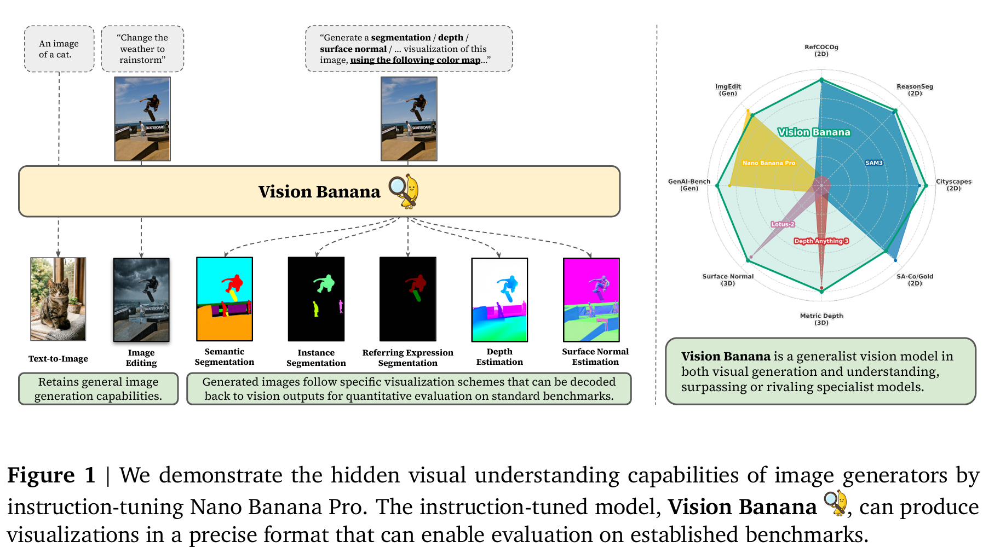

本文将视觉生成模型定位为"视觉基座模型"，并通过指令微调实现模型对齐，使其能够依据提示词生成符合预期格式的视觉输出，整体流程如上图。

具体而言，模型会根据指令生成 RGB 图像，我们可从该图像中解码得到各类计算机视觉任务输出结果。本文设计了配套指令提示词与可解码可视化方案，打通视觉生成结果与标准评测格式之间的转换通道，使我们能够采用可量化指标开展基准测试。

举个例子：输入提示词"将滑板类别分割为纯黄色 < 255, 255, 0>"，只需筛选像素值接近 < 255,255,0 > 的像素做聚类，就能快速提取滑板对应的分割掩码。

该方法具有三大优势：

1. 单一套统一模型即可适配海量任务；完成指令微调后，所有任务共享模型权重，仅需更换提示词就能切换任务
2. 所需新增训练数据量较少，指令微调仅教会模型如何将各类视觉任务结果编码为 RGB 图像
3. 模型能够保留原生图像生成能力 — 模型输出本质仍是全新 RGB 图像，不会破坏生成基础能力

---

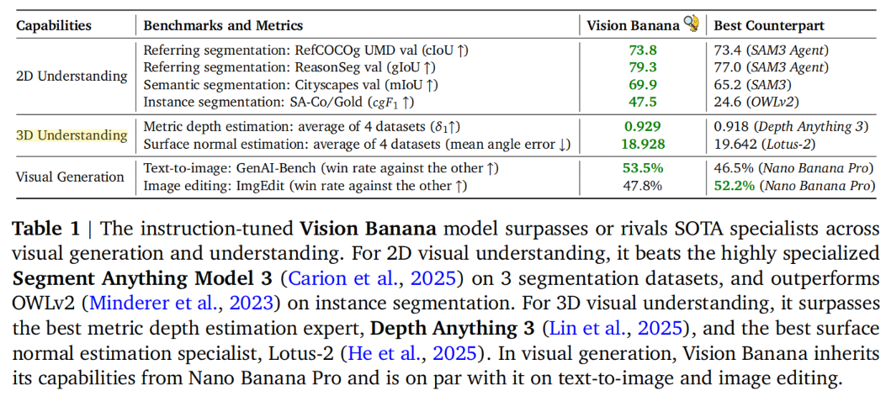

上图表示该模型对比各种 specialist 模型的性能，可以看出在多种任务都超过了专业模型。

### 启示

- 首先，它表明图像生成器本质上属于通用视觉学习系统，其生成式视觉预训练与语言模型预训练一样具有基础性作用
- 其次，它表明图像生成可以作为一种有效的学习方法，这种通用接口旨在实现统一的视觉理解，其作用类似于文本生成在语言理解和推理中的角色

## 方法

> 为严谨地研究和评估这些能力，我们需要对模型进行**校准**，使其生成的可视化结果能够反向解码为实际视觉任务输出以便定量分析。例如，在度量深度估计任务中，生成的深度热图必须能逆转换为物理深度值以进行量化评估。因此，我们通过对基础模型 Nano Banana Pro 进行指令调优，并结合一系列以可逆方式表述的视觉任务数据，开发出了 Vision Banana。具体而言，我们将**视觉任务数据**以极低比例混合到 Nano Banana Pro 自身的训练数据集中。这一过程使模型产生的生成表征能够对应到可测量的物理几何结构和语义标签，从而使得我们的通用型模型能够与特定任务专用模型进行对比评估。

## 基于图像生成器的通用视觉模型（Vision Banana）

本节给出 Vision Banana 在各种 CV 任务上的表现效果。

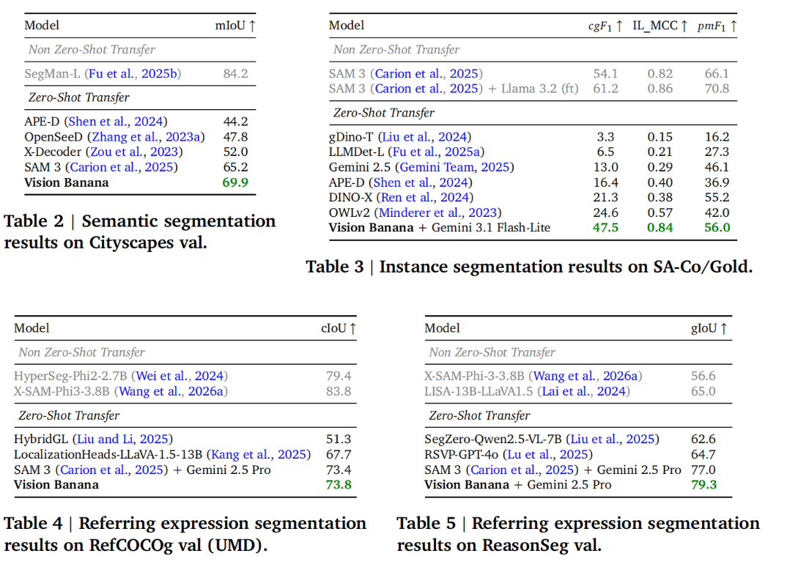

- Semantic segmentation 语义分割
- Instance segmentation 实例分割
- Referring expression segmentation 指代表达分割

### 2D 语义理解

传统图像分割任务：依赖复杂的具体**特定任务**的模型将像素划分为语义类别或物体示例（高度专门化的架构设计 + 昂贵的人工标注掩码）。

本文 Vision Banana：挑战了这种 prevailing paradigm（主流范式），我们无需依赖大量精心制作的分割样本进行训练，而是利用基础图像生成模型所学习到的丰富表征信息。通过指示模型生成多色分割掩膜图像，我们获得密集的分割图谱，并从中解码出单个掩膜，从而实现基于图像生成的分割任务（具体见上表）。

这种精妙的生成方法超越了经过高度调优的专业模型，在所有评估的分割基准上均实现了 SOTA 零样本迁移性能。我们将其与未在领域内数据（即这些基准的训练集）上训练过的其他方法进行比较，并在表格中标注为"零样本迁移"。

> 生成式模型学习到了丰富的表征信息，通过指示模型分割就直接从图像中解码出分割掩码。

**语义分割**：语义分割是指将每个像素划分为预定义类别，而不区分具体实例。例如，Cityscapes 基准集（Cordts 等人，2016）定义了 19 个类别，包括道路、人物和天空。虽然实例分割和参考表达式分割也能传递语义信息，但我们仍使用"语义分割"这一术语。

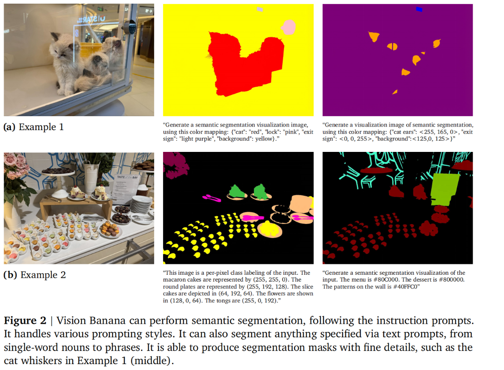

此处严格而言，该概念仅适用于**类别层面**的语义分割任务。经典语义分割任务的这一特性可通过**文本提示**进行指定，我们训练模型遵循此类指令：要求模型生成一幅可视化图像，其中每个像素均根据其类别着色，如图所示。

关键在于，我们的方法采用**开放词汇表设计**：目标类别不受固定集合限制，可在提示中**动态指定**并附带相应的颜色映射关系。我们支持多种提示方式，包括**自然语言描述**（例如"马卡龙蛋糕用黄色表示"）以及**结构化的 JSON 映射**方案——颜色可指定为命名颜色、**十六进制代码**或 **RGB 三元组**。为进行定量评估，我们会对生成图像进行后处理，将每个像素归入其目标颜色在 RGB 空间中最接近的类别。

> Vision Banana 在语义分割任务上，可以用各种开放词汇表与颜色映射关系进行指定，利用其生成能力得到分割掩码。

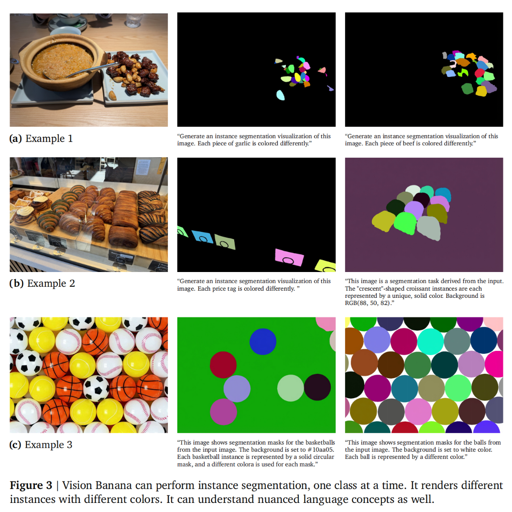

**实例分割**：与语义分割不同，实例分割要求模型能够区分属于同一类别的各个独立对象。例如，如果一张图像包含五只狗，我们期望模型为每只动物生成独立的掩码。这对 Vision Banana 提出了独特挑战：**由于实例数量无法预先确定，我们无法在提示中指定具体颜色**。为解决这一问题，我们仅提供**目标类别**和**背景颜色**作为输入，指示模型为每个独立实例分配唯一且不同的颜色，并允许模型动态为该类别下的不同实例分配不同颜色。

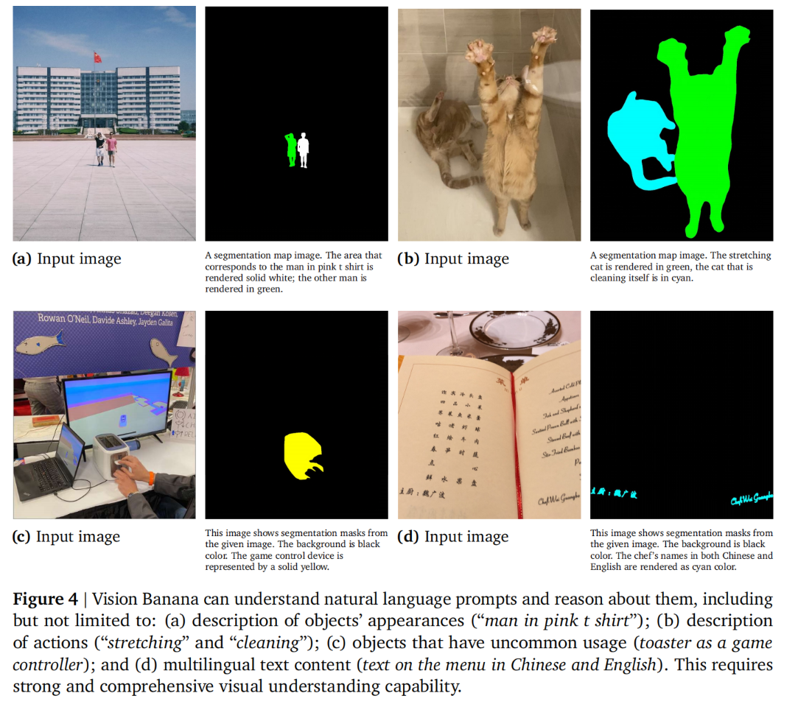

**指代表达分割**：与传统的固定类别分割不同，参照表达式分割旨在评估模型对由长篇自由形式自然语言查询所描述对象进行分割的能力。该任务要求模型能够理解并推理微妙的自然语言表达，并捕捉对象之间的复杂关系。

### 3D Understanding from Monocular Images（单眼图像理解三维空间）

**Metric Depth Estimation（度量深度估计）**：深度估计的目标是从单目图像中生成深度图，其中每个像素的值代表从相机平面到观测物体的实际几何距离。

这是计算机视觉领域的基础任务，广泛应用于机器人技术、增强/虚拟现实以及自动驾驶等领域。然而，深度估计本质上属于不适定问题，因为二维投影会丢失关键的三维几何信息。此外，由于多视图场景中缺乏视差线索（即使已知相机内参），单目深度估计尤其具有挑战性。

传统深度估计：视为是一个密集的逐像素监督回归任务，采用专门的架构和领域特定的损失函数；最新的 SOTA 在训练、推理过程都需要依靠详细的内参（camera intrinsic）以缓解深度估计固有的模糊性。

本文假设：生成建模中对模式的**探索特性**能够**自然解决训练目标的模糊性**，从而无需使用此类专门技术。此外，预训练过程中积累的广泛世界知识使该模型在物体尺寸和距离方面比窄目标模型具有更强的先验知识。为使 Nano Banana Pro 能够以度量单位估算深度，我们要求该模型输出精心构建的深度值伪彩色可视化结果。

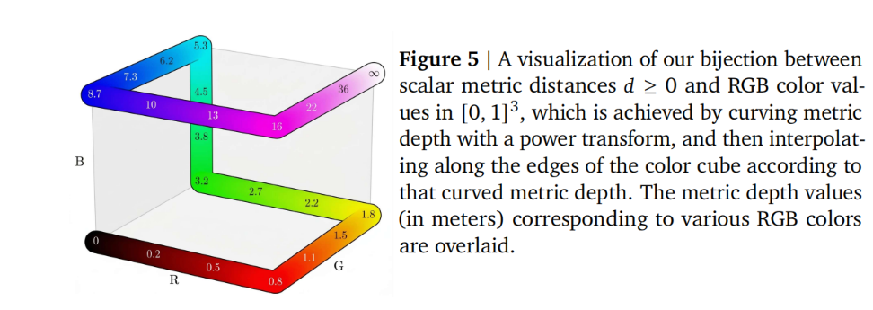

> 将深度转化为 RGB 图像（具体原理还需要参考 Barron 等人 2023 年 ICCV 论文《Learning to Estimate Depth from Monocular Images》）

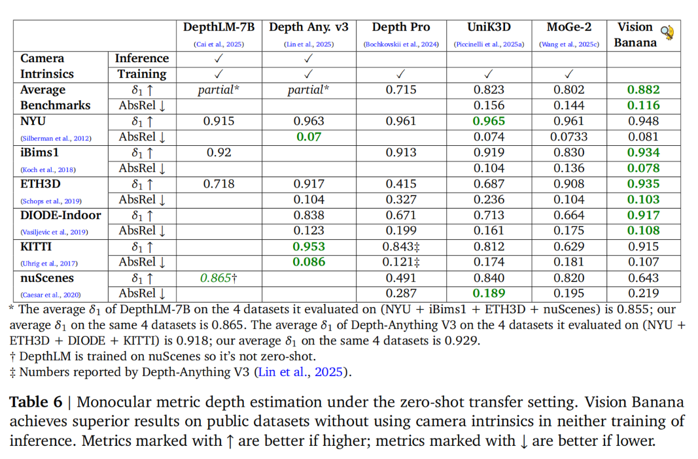

本次实验完全不使用任何真实世界的深度数据，并排除了所有评估所用深度数据集中的训练数据。需要特别说明的是，这一结果的实现**无需**在训练或推理过程中依赖**相机参数**（无论是内参还是外参）。通过充分利用其**基础模型中蕴含的丰富几何先验信息**，Vision Banana 仅凭视觉特征和物体关系即可推断出绝对尺度，从而实现对任意输入图像的零样本泛化能力。

定性分析：

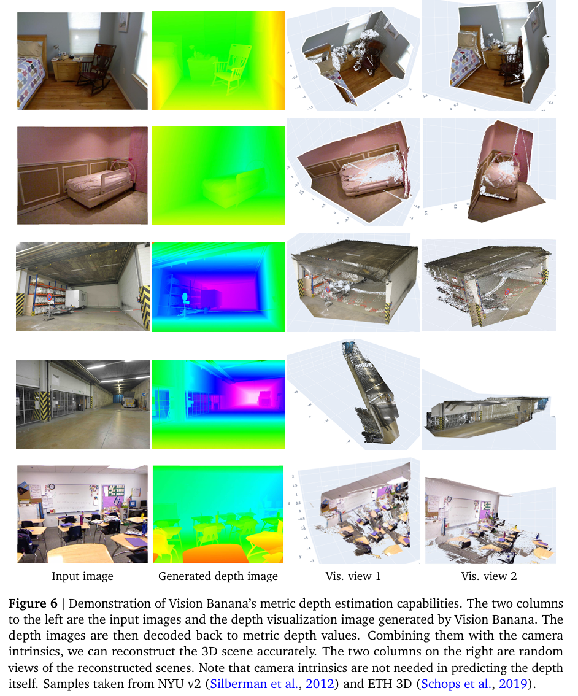
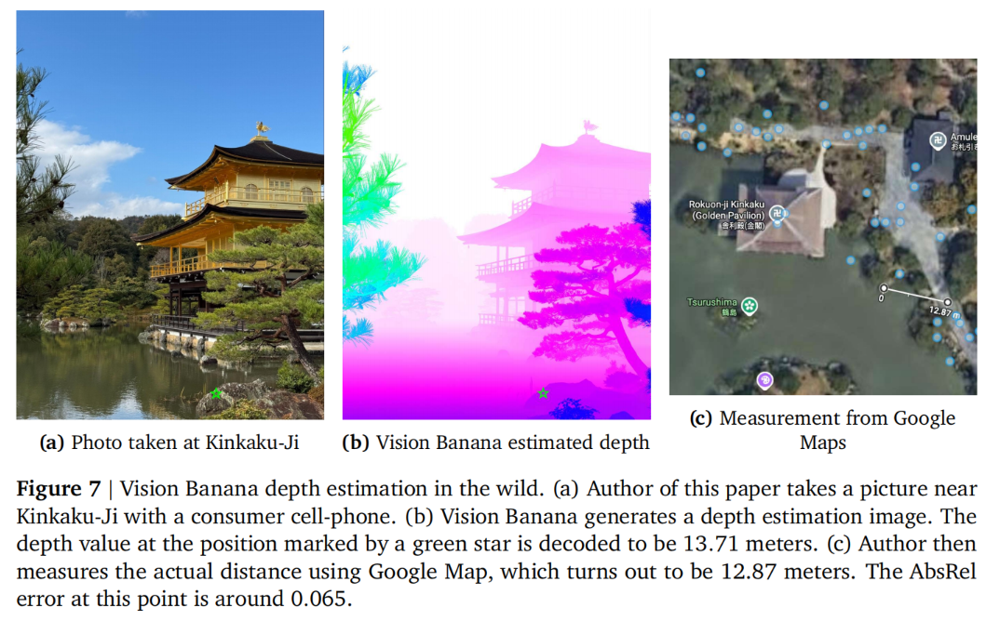

**表面法向量估计**：表面法线估计是另一项关键的视觉任务。表面法线是取值范围在 -1.0 至 1.0 之间的单位向量 (x, y, z)，可作为表征局部几何形状和场景结构的重要指标。与度量深度所需的复杂颜色映射不同，表面法线的可视化本质上与 RGB 色彩空间相契合，从而能够直接集成到我们的模型中。

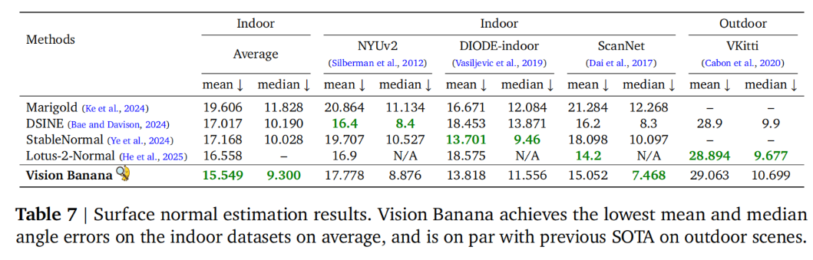
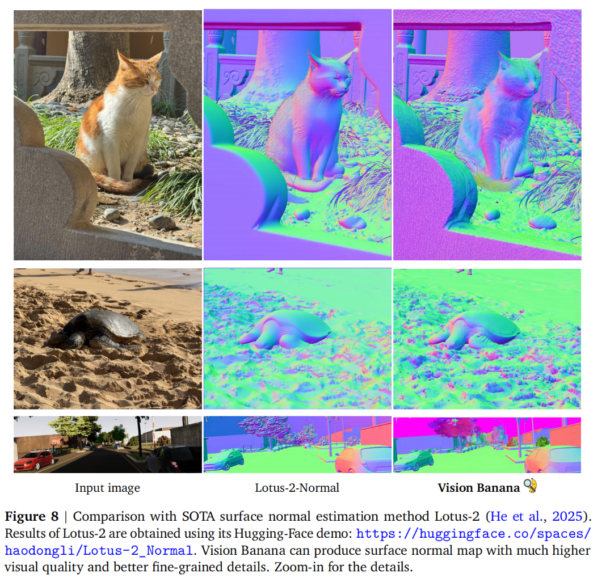

与 SOTA 水平相当。

## 讨论与个人见解

本文章为真正的基础视觉模型以及基于视觉的人工通用智能（AGI-V）铺平了道路。

基于本文提出的 Vision Banana 模型，我们是否可以对其进行扩展至世界模型（WM）？以下是个人的见解：

1. LLM 理解物理世界规则、材质、纹理等，但是缺少视觉信息；纯视觉模型则缺少物理世界规则，只能依靠训练进行分类
2. Vision Banana 模型很好地统一了这一点
3. 明确几点：第一，LLM 可以描述客观世界，但是是基于人类的视角，本质上还是相当于一个巨大的知识库，充其量可能可以通过噪声在低概率的情况下推断某些新的东西；第二，视觉是给人看的，也是不可或缺的
4. 现状：世界模型（这里以李飞飞的分类法：渲染器、模拟器、规划器）。渲染器如 Sora，无法直接处理 3D 场景，对物体材质、纹理、性质无法理解，对于光照也无法直接处理，难以通向 AGI；规划器如 VLA，依靠模拟器推理行动。于此，个人认为模拟器如 Marble（李飞飞团队），可以成为通向 AGI 的基础
5. Vision Banana 模型的出现为训练理解物理世界的模拟器提供了捷径，这里列出个人的理解与思路：

> 1. 利用 Vision Banana 模型及大语言模型对于世界的理解，由一张图片生成 3D 场景（图片 → 深度提取 → 体素生成），这里关注体素生成。传统体素仅包含位置信息，而结合 Vision Banana 模型以及 LLM 可以生成包含材质、纹理、性质等信息的体素
> 2. 训练 Bert（Swin）补全 3D 场景
> 3. 训练体素转 3DGS 高斯粒子的模型（这里参考的是李飞飞团队的 Marble 模型，3DGS 高斯粒子拥有更好的渲染效果，更贴近现实世界）。该模型国内也有相关工作，如李飞飞团队、浙大 VolSplat（这里可以利用 LLM 对世界的理解进行调整，迁移学习）
> 4. 在此基础上的模拟器可以生成贴近现实世界的 3D 场景，在此基础上添加时间维度，通过视频与 Vision Banana 模型不断对齐，训练其理解物理世界规则（视频能力）
> 5. 后文在此模拟器基础上，模拟器的预测功能得到的动作数据结合 VLA 的规划功能，或许可以实现较好的效果
