> StableDiffusion 是一种基于[扩散模型](/glossary/diffusion-model/)的生成模型，能够生成高质量的图像。记得第一次使用的时候还是高一，用 qq 登录一个啥网站，然后生成第一张图片的时候的惊奇感，那个时候生成一次图片还需要排队，还需要等好久。=v=往事

---

我们带着一些问题去了解 StableDiffusion 模型的原理和实现：

1. What is StableDiffusion? 什么是 [StableDiffusion](/glossary/diffusion-model/) 模型？
2. How to visually understand the [diffusion model](/glossary/diffusion-model/)? 如何可视化理解扩散模型？
3. How to derive the diffusion model mathematically? 如何推导扩散模型的数学原理？
4. How to train a StableDiffusion model and infer it? 如何训练 StableDiffusion 模型并进行推理？

## 1. 什么是 StableDiffusion 模型？

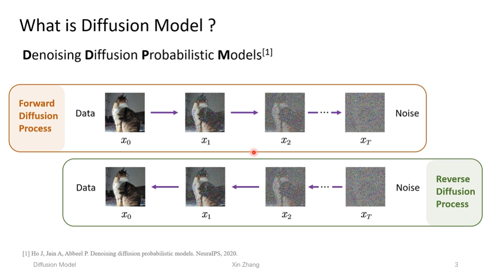

Denoising Diffusion Probability Model 加噪扩散概率模型，顾名思义一下，**加噪**，就是如图，$x_{t-1}$ 在加入一个均值为 0、方差为 1 的[高斯噪声](/glossary/gaussian-noise/)，得到 $x_t$，一步一步地加噪，直到得到**纯噪声图像**。

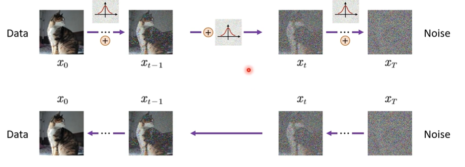

而**去噪**，就是如图，从 $x_t$ 开始，我们训练一个模型（神经网络）来预测 $x_t$ 的噪声，然后在 $x_t$ 的基础上减去预测的噪声，得到 $x_{t-1}$，以此类推，直到得到原始图像。

而我们不可能在每一步都训练一个模型的，因为这样会非常耗时，而且需要大量的计算资源。为此，我们会为模型注入一个 $t$ 的变量（timestep），来让模型知道当前是在第几步，这样我们就可以训练一个模型来同时处理所有的步骤了。

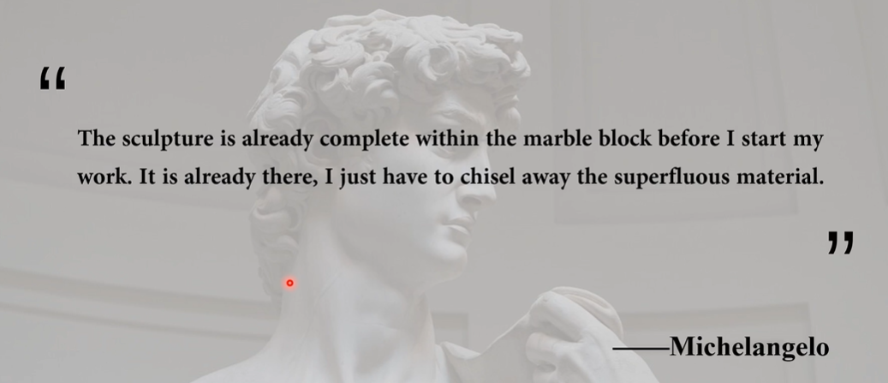

---

大佬的话

---

**从数学角度深入：**

### 1. 加噪过程

我们定义一个**前向扩散过程**，从原始图像 $x_0$ 开始，逐步加入噪声，直到得到纯噪声 $x_T$。这个过程可以表示为：

$$
x_t = \epsilon(x_t, t) + \sigma \epsilon_t
$$

其中，$\epsilon$ 是一个噪声函数，$t$ 是时间步，$\sigma$ 是噪声标准差。

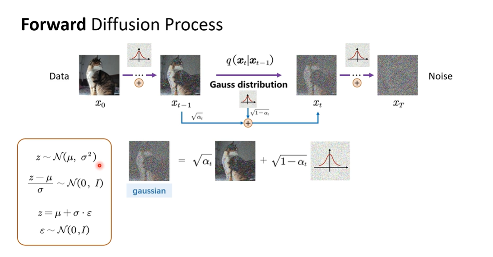

如何理解这个公式：

$$
x_t = \epsilon(x_t, t) + \sigma \epsilon_t
$$

首先对于任意一个正态分布

$$
z \sim \mathcal{N}(\mu, \sigma^2)
$$

我们通过一些简短的数学变换可以得到一个标准的正态分布

$$
\frac{z-\mu}{\sigma} \sim \mathcal{N}(0, I)
$$

那对于图像的任意一个随机采样的像素，我们可以将其表示为：

$$
z = \mu + \sigma \cdot \varepsilon, \quad \varepsilon \sim \mathcal{N}(0, I)
$$

其中，$\epsilon_t$ 是一个标准正态分布的随机变量，$\sigma$ 是噪声的标准差，$\mu$ 是图像像素的均值。通过这个变换，我们可以将任意一个图像像素表示为一个标准正态分布的随机变量，这个过程我们叫做 **[重参数化技巧](/glossary/reparameterization-trick/)**（这里联系 [VAE](/glossary/vae/) 的重参数化技巧，也用到了同样的技巧）。

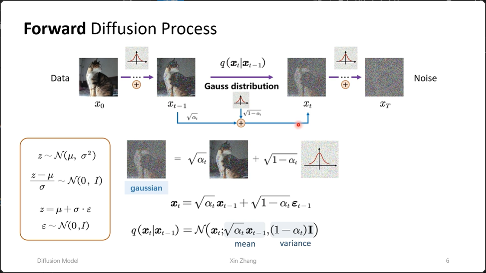

如图，我们用 $x_t = \sqrt{\alpha_t} x_{t-1} + \sqrt{1-\alpha_t} \varepsilon_{t-1}$ 来表示 $x_t$，其中 $\sqrt{\alpha_t}$ 是均值项 mean，$\sqrt{1-\alpha_t}$ 是方差项 std。

> **💡 马尔可夫过程**：这个前向扩散过程是一个典型的 [马尔可夫过程](/glossary/markov-process/)，即每一步的状态 $x_t$ **只依赖于上一步** $x_{t-1}$，与更早的状态无关：
> $$
> q(x_t \mid x_{t-1}, x_{t-2}, \dots, x_0) = q(x_t \mid x_{t-1})
> $$
> 这一性质使得联合分布可以分解为条件分布的连乘，也使得我们可以直接从 $x_0$ 跳跃式计算任意 $x_t$（详见下文）。

$$
q(x_t \mid x_{t-1}) = \mathcal{N}\left(x_t; \sqrt{\alpha_t} x_{t-1},\ (1-\alpha_t)\mathbf{I}\right)
$$

代表在 $x_{t-1}$ 的基础上，加入一个均值为 $\sqrt{\alpha_t} x_{t-1}$、方差为 $(1-\alpha_t)\mathbf{I}$ 的高斯噪声，得到 $x_t$。

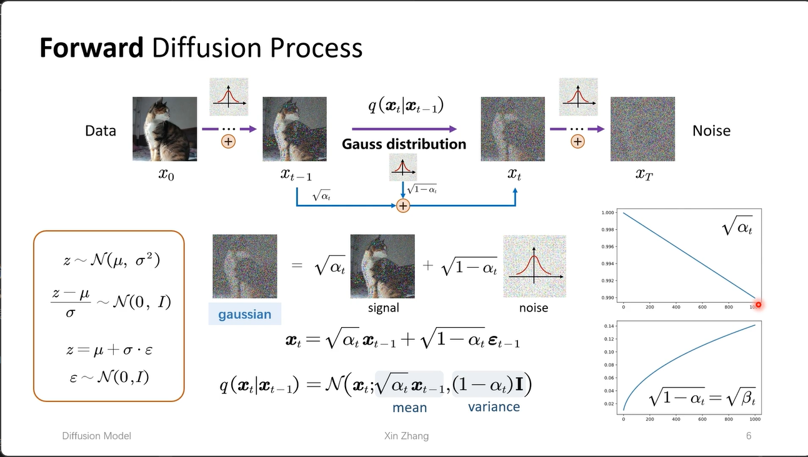

与 $\sqrt{\alpha_t}$ 相乘的是 signal，与 $\sqrt{1-\alpha_t}$ 相乘的是 noise，在原论文中，代表是一个 **[信噪比](/glossary/snr/)** 的问题（梦回计网物理层香农定理）。

如图，右侧的是这两个参数随时间变化的趋势，称 **Schedule**。随着时间的增长，$\sqrt{\alpha_t}$ 会越来越小，代表 signal 的权重会越来越小。如何理解：对于未加噪的图像，我们一开始加的噪声大，对图像的影像也大，但是到后期，我们的图像噪声已经很大，**为了让每一次加噪都对图像的影像尽可能一致**，我们就会将 $\sqrt{\alpha_t}$ 设置为越来越小，代表 signal 的权重会越来越小。

> **重要的公式：**
> $$
> x_t = \sqrt{\alpha_t} x_{t-1} + \sqrt{1-\alpha_t} \varepsilon_{t-1}
> $$

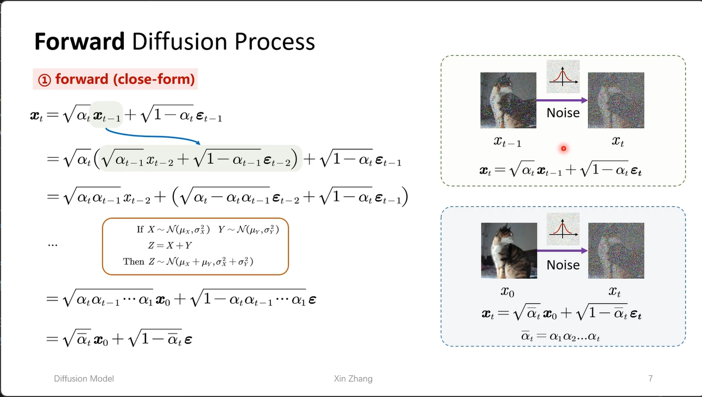

跳跃式加噪

利用[马尔可夫性质](/glossary/markov-process/)，我们可以直接从 $x_0$ 计算任意时间步 $x_t$，无需逐 step 迭代。定义 $\bar{\alpha}_t = \prod_{i=1}^t \alpha_i$，则有：

$$
x_t = \sqrt{\bar{\alpha}_t} x_0 + \sqrt{1-\bar{\alpha}_t} \epsilon
$$

这就是 **跳跃式加噪**，在训练时只需一步即可得到任意时间步的噪声图像，大幅提升训练效率。

## 2. 去噪过程

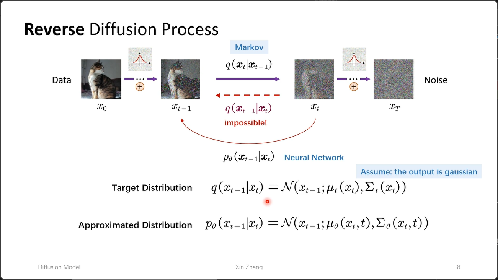

从 $x_T$ 再到 $x_{t-1}$，是几乎不可能的，所以为了反向推出 $x_{t-1}$，我们需要训练一个模型，来预测 $x_t$ 的噪声，然后在 $x_t$ 的基础上减去预测的噪声，得到 $x_{t-1}$，以此类推，直到得到原始图像。

我们认为，我们的目标分布 $q(x_{t-1} \mid x_t) = \mathcal{N}\left(x_{t-1};\ \mu_t(x_t),\ \Sigma_t(x_t)\right)$ 是一个高斯分布，而我们大胆地假设，我们的模型 $p(x_t \mid x_{t-1})$ 也是一个高斯分布，即：

$$
p_\theta(x_{t-1} \mid x_t) = \mathcal{N}\left(x_{t-1};\ \mu_\theta(x_t, t),\ \Sigma_\theta(x_t, t)\right)
$$

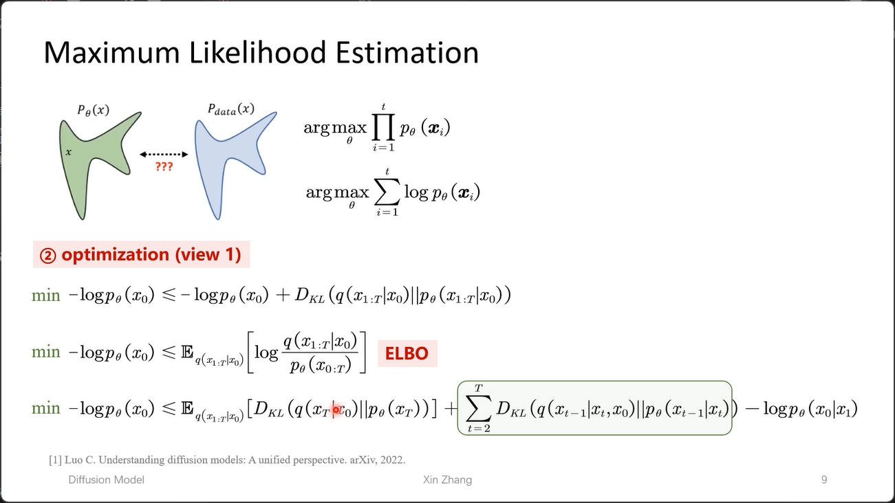

> **重要的公式：**
> [最大似然估计](/glossary/maximum-likelihood/) = 最小化负对数似然函数

$$
\log \mathcal{L}(\theta \mid x_t) = -\frac{1}{2} \left(\frac{1}{\Sigma_\theta(x_t, t)} \left(\frac{x_{t-1} - \mu_\theta(x_t, t)}{\Sigma_\theta(x_t, t)}\right)^2 + \frac{1}{2} \log \Sigma_\theta(x_t, t)\right)
$$

**这里对应 [VAE](/glossary/vae/) 的损失函数**

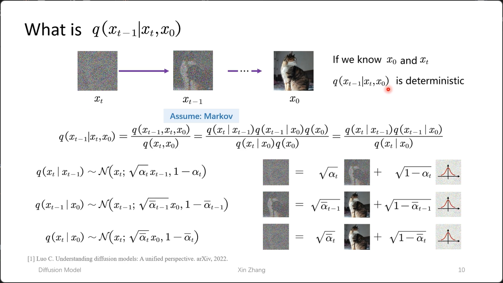

> **重要的公式：**

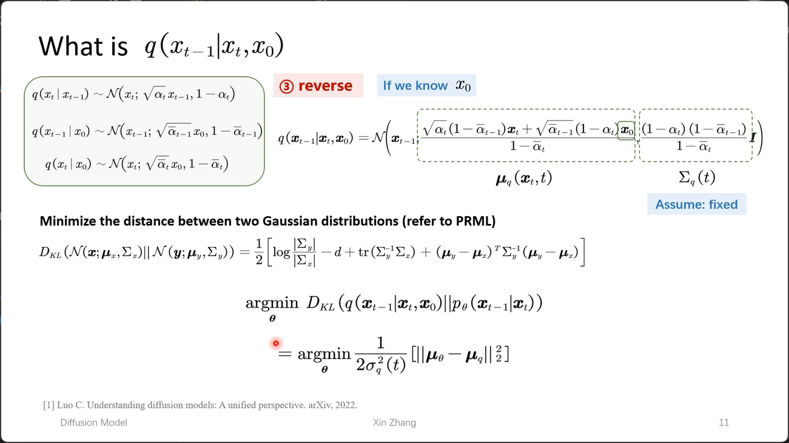

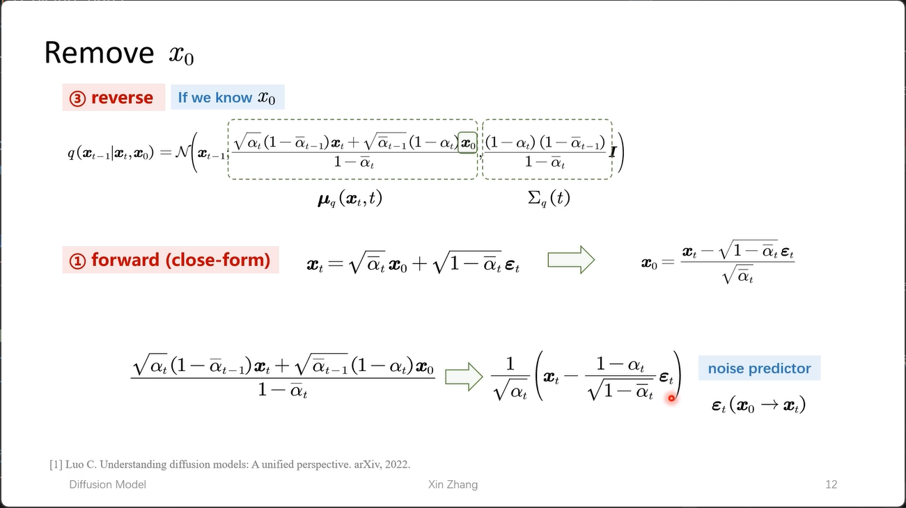

对于整个过程，实际上就只有一个参数 $\epsilon$ 未知，实际上我们训练的模型就是去预测 $\epsilon$（注意这里的噪声是从 $x_0$ 到 $x_T$ 的噪声）。

**为啥不直接一步预测呢**：这里每一次修正都存在一个修正的过程

## 3. 训练与采样推导

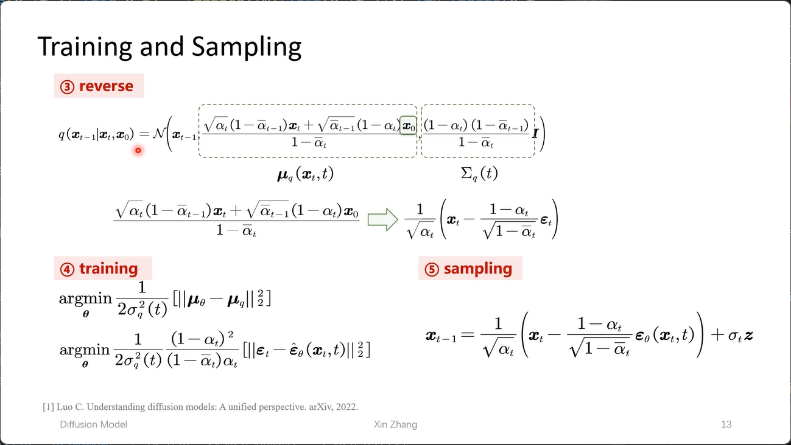

## 4. 训练步骤

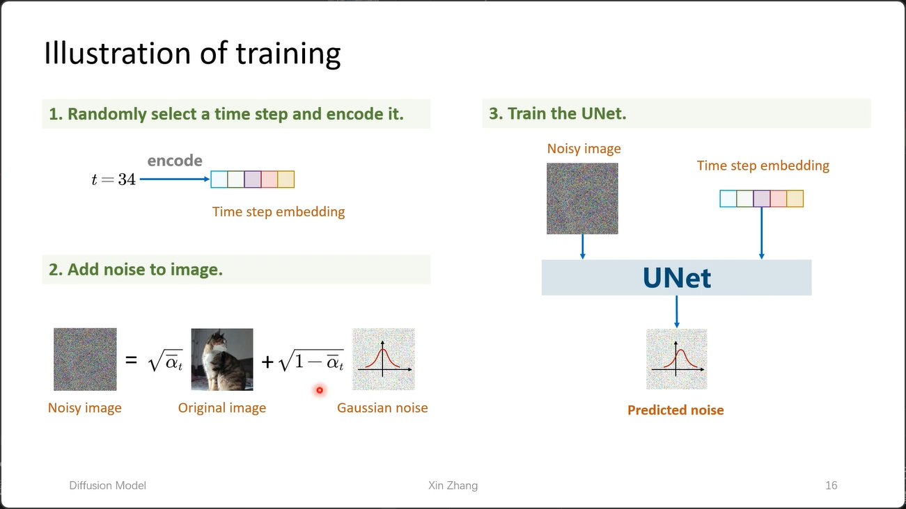

1. 随机选一个 time step，然后 encode
2. 加噪
3. 训练神经网络，一般是 [U-Net](/glossary/u-net/)
4. **这里计算的损失就是不同 timestep 对应的两个高斯噪声的 L2 距离**

## 5. 采样

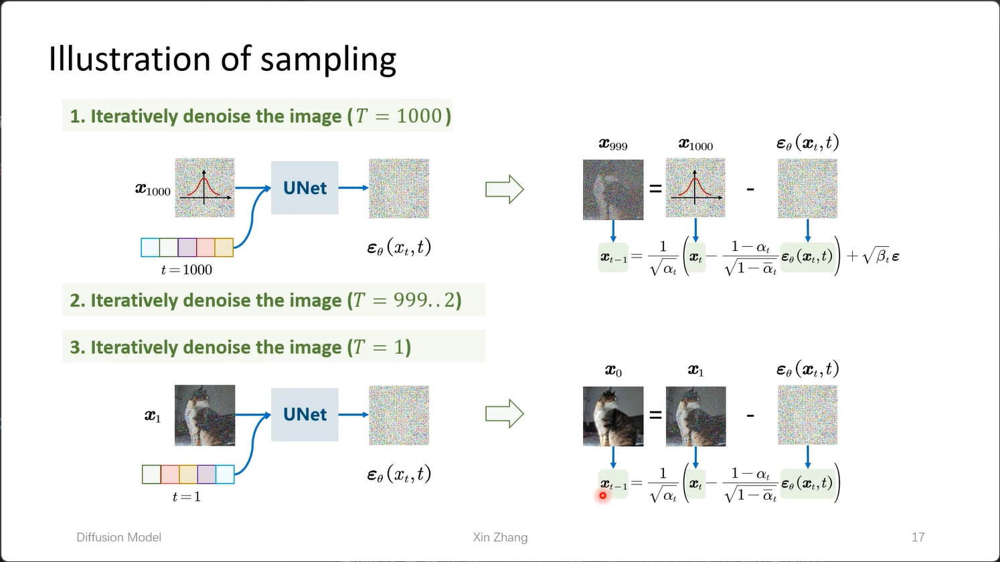

1. 从纯噪声开始采样，输入噪声与 time step 后，得到预测的噪声
2. 从 $x_t$ 的基础上减去预测的噪声，得到 $x_{t-1}$
3. 以此类推，直到得到原始图像

---

## 参考与延伸阅读

1. **DDPM** — Ho, J., Jain, A., & Abbeel, P. (2020). *Denoising Diffusion Probabilistic Models*. NeurIPS 2020. [[arXiv:2006.11239](https://arxiv.org/abs/2006.11239)]
2. **扩散模型起源** — Sohl-Dickstein, J., Weiss, E. A., Maheswaranathan, N., & Ganguli, S. (2015). *Deep Unsupervised Learning using Nonequilibrium Thermodynamics*. ICML 2015. [[arXiv:1503.03585](https://arxiv.org/abs/1503.03585)]
3. **Stable Diffusion** — Rombach, R., Blattmann, A., Lorenz, D., Esser, P., & Ommer, B. (2022). *High-Resolution Image Synthesis with Latent Diffusion Models*. CVPR 2022. [[arXiv:2112.10752](https://arxiv.org/abs/2112.10752)]
4. **重参数化技巧** — [[glossary 条目](/glossary/reparameterization-trick/)]
5. **VAE** — [[glossary 条目](/glossary/vae/)]

最好的讲解： https://www.bilibili.com/video/BV1xih7ecEMb/?share_source=copy_web&vd_source=9ddae8a660784d5c8d074cccde4334d6